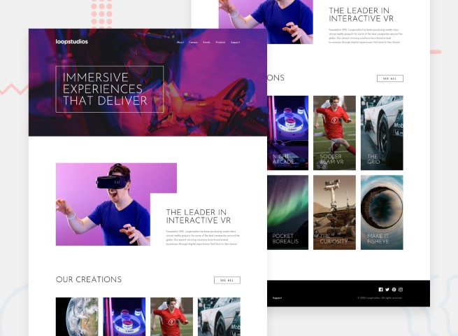

# Frontend Mentor - Loopstudios landing page solution

[Project live](https://loopstudioslandingpage-isaac.netlify.app)



## Table of contents

- [Frontend Mentor - Loopstudios landing page solution](#frontend-mentor---loopstudios-landing-page-solution)
  - [Table of contents](#table-of-contents)
  - [Overview](#overview)
    - [The challenge](#the-challenge)
    - [Screenshot](#screenshot)
    - [Links](#links)
  - [My process](#my-process)
    - [Built with](#built-with)
    - [What I learned](#what-i-learned)
    - [Continued development](#continued-development)

## Overview

### The challenge

Users should be able to:

- View the optimal layout for the site depending on their device's screen size
- See hover states for all interactive elements on the page

### Screenshot

- [mobile](./design/mobile.png)

- [mobile menu](./design/mobile-menu.png)

- [desktop](./design/desktop.png)

### Links

- [Live site](https://loopstudioslandingpage-isaac.netlify.app)

## My process

### Built with

- Mobile-first workflow
- Semantic HTML5 markup
- CSS custom properties
- SASS
- Flexbox
- CSS Grid
- JS

### What I learned

In this project I trained using mixins with default parameters

```css
@mixin link-hover($width: 90%, $bottom: -5px) {
 & {
  position: relative;
 }
 &::before {
  content: " ";
  display: block;
  position: absolute;
  bottom: $bottom;
  left: 50%;
  transform: translateX(-50%);
  width: 0;
  height: 2px;
  background-color: var(--white);
  transition: 1s ease-in-out;
 }

 &:hover {
  transform: scale(1.3);

  &::before {
   width: $width;
  }
 }
}
```

Besides that, I used SASS @for statements, which come in handy for repetitive actions, such as:

```css
@for $i from 1 through 8 {
      &:nth-of-type(#{$i}) {
       background-image: url("../../images/mobile/#{$i}.jpg");
      }
     }
```

### Continued development

I have decided to conclude this challenge having the goal of practising simple landing pages with HTML and SASS. Simple I took a brake to study for my university exams, I felt the need to practice the foundations.
